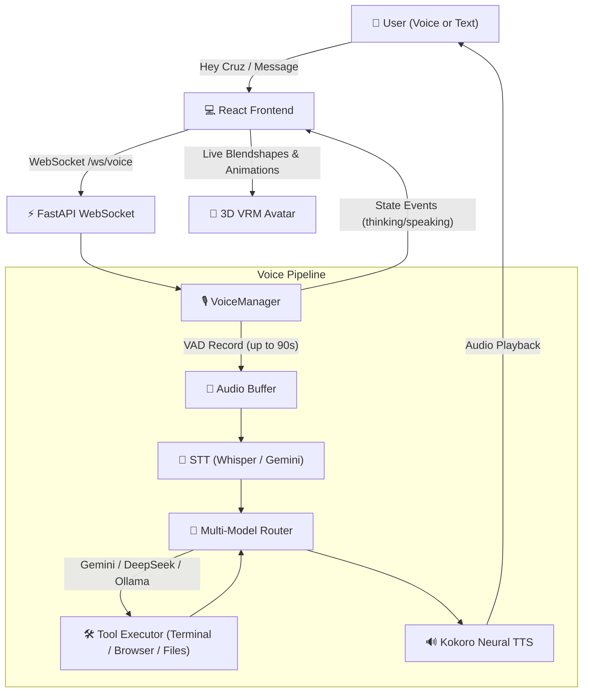
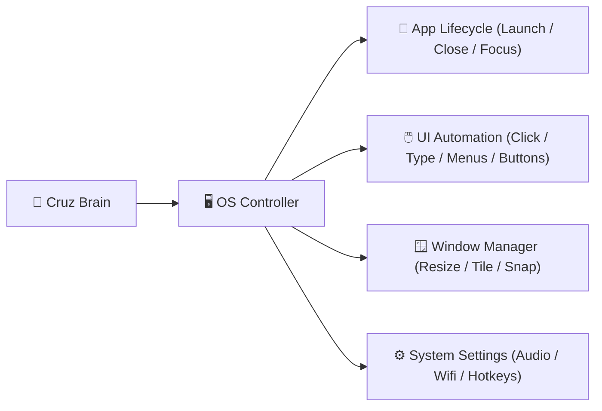

# 🌟 CRUZ AI: System Architecture & Future Roadmap

CRUZ is an autonomous, multimodal, hands-free AI assistant designed for pair programming, web research, desktop automation, and natural continuous voice interaction with a real-time 3D interactive anime avatar.

---

## 📑 Table of Contents
1. [Core Features & Current Capabilities (Small to Small Detail)](#1-core-features--current-capabilities)
   - [A. Interactive 3D Anime Avatar](#a-interactive-3d-anime-avatar)
   - [B. Natural Voice & Wake Word Engine](#b-natural-voice--wake-word-engine)
   - [C. Intelligent Multi-Model Brain & Router](#c-intelligent-multi-model-brain--router)
   - [D. Dual-Layer Memory Architecture](#d-dual-layer-memory-architecture)
   - [E. Tool Execution & Autonomous Skills](#e-tool-execution--autonomous-skills)
   - [F. Frontend UI & Experience](#f-frontend-ui--experience)
2. [Current Architecture Flow](#2-current-architecture-flow)
3. [Strategic Future Roadmap](#3-strategic-future-roadmap)
   - [Phase 1: Sub-300ms Ultra-Low Latency Pipeline](#phase-1-sub-300ms-ultra-low-latency-pipeline)
   - [Phase 2: Full Autonomous Desktop & OS Control](#phase-2-full-autonomous-desktop--os-control)
   - [Phase 3: Vision-Language Screen Perception (VLM Agent)](#phase-3-vision-language-screen-perception-vlm-agent)
   - [Phase 4: Proactive Intelligence & Background Daemon](#phase-4-proactive-intelligence--background-daemon)
4. [Implementation Action Plan](#4-implementation-action-plan)

---

## 1. Core Features & Current Capabilities

### A. Interactive 3D Anime Avatar
* **VRM 3D Model Format**: Rendered in WebGL via `@pixiv/three-vrm` and `three.js`.
* **360° Mouse Orbit Controls**: Drag anywhere on the 3D stage to rotate smoothly around the character with inertia damping (`dampingFactor: 0.08`). Polar clamps prevent unnatural camera flips.
* **Real-time Gaze & Cursor Tracking**: The avatar's head and neck track the mouse cursor across the screen when idle and listening.
* **Facial Shading & Tone Mapping**: Studio-grade lighting setup (warm key light, cool rim, ambient fill, and hair light) with calibrated ACES Filmic exposure to prevent white-washed textures and preserve facial depth.
* **Animated Lip-Sync**: Multi-vowel mouth shape articulation (`aa`, `oh`, `ih`, `ou`) synchronized dynamically to speaking cadence.
* **Natural Procedural Animation**:
  * Organic breathing cycle (chest and spine displacement).
  * Natural weight-shifted contrapposto standing posture.
  * State-aware head movements: attentive listening tilts, thoughtful upward pensive angles, and rhythmic conversational nodding during speech.
  * Idle eye blinking with randomized timing.
* **Detailed Technical Spec & Benchmarks**: See [`docs/VRM_AVATAR_AND_RESOURCES.md`](VRM_AVATAR_AND_RESOURCES.md) for full procedural math, lighting setup, and system resource profiling.

### B. Natural Voice & Wake Word Engine
* **Hands-Free "Hey Cruz" Wake Word**:
  * Background speech recognition detecting `"Hey Cruz"`, `"Cruz"`, `"Hi Cruz"`, `"Okay Cruz"`, plus phonetic variants (`"cruise"`, `"crews"`).
  * Automatically pauses during active speech/thinking and seamlessly resumes when idle.
* **Continuous Conversational Loop**:
  * After Cruz finishes speaking, she automatically resumes listening without requiring you to say "Hey Cruz" again.
  * Extended listening timeout (**90 seconds**) gives you time to think before responding.
  * Exit phrase detection gracefully concludes sessions upon hearing *"bye"*, *"goodbye"*, or *"stop talking"*.
* **Dual-Threshold Voice Activity Detection (VAD)**:
  * Energy-based calibration with hangover filtering to prevent premature cutoffs during natural mid-sentence pauses.
  * 400ms pre-roll audio ring buffer to capture opening syllables cleanly.
* **Hybrid Speech Recognition & Neural TTS**:
  * **STT**: Offline local `pywhispercpp` (Whisper Small) with cloud Gemini Audio fallback.
  * **TTS**: Kokoro-82M neural voice synthesis (`af_heart` / Google Gemini Preview TTS) producing human-like cadence.
* **Real-Time WebSocket Protocol**:
  * Bi-directional communication on `ws://localhost:8000/ws/voice` broadcasting real-time state transitions (`listening`, `transcribing`, `thinking`, `speaking`, `idle`).

### C. Intelligent Multi-Model Brain & Router
* **Multi-Provider Fallback Routing**:
  1. **Google AI Studio (Gemini 2.5 Flash / 3.6 Flash)**: High-speed, high-reasoning primary model.
  2. **OpenCode Zen**: Free hosted gateway (`deepseek-v4-flash-free`).
  3. **OpenRouter Free Tier**: Auto-fallback across free hosted models.
  4. **Local Ollama**: Local offline inference (`qwen2.5:3b` / `llama3.2`).
* **Unbounded Task Execution**: 300-second (5-minute) HTTP timeouts ensure complex multi-step coding or research tasks are never aborted mid-operation.

### D. Dual-Layer Memory Architecture
* **Short-Term Memory**: Sliding window of recent turns (configurable `MEMORY_WINDOW_SIZE = 20`) preserved per session.
* **Persistent Long-Term Memory**:
  * SQLite database (`data/memory.db`) storing extracted user facts, preferences, project paths, and personal context.
  * Background asynchronous fact extractor runs after each turn to prevent latency spikes.

### E. Tool Execution & Autonomous Skills
* **Filesystem Tools**: Read, write, replace content, list directories, and view code files.
* **System Terminal Execution**: Run PowerShell commands directly on the host system.
* **Playwright Browser Automation**: Full browser control with profile persistence, tab management, web scraping, and search execution.
* **Deep Web Research**: Integration with Firecrawl API for web crawling and markdown extraction.

### F. Frontend UI & Experience
* **Tech Stack**: React, TypeScript, Vite, Vanilla CSS.
* **Aesthetics**: Dark-mode glassmorphism, glowing status pills, bouncing soundwave visualizers, and expandable panels.
* **Markdown & Streaming Chat**: Code block formatting with copy controls and typed streaming support.

---

## 2. Current Architecture Flow

---

## 3. Strategic Future Roadmap

### Phase 1: Sub-300ms Ultra-Low Latency Pipeline
To make Cruz respond with instantaneous, human-like reaction speeds:

1. **Streaming Audio Pipeline (Chunked TTS)**:
   - Instead of waiting for the full LLM answer to generate before synthesizing speech, stream LLM tokens to TTS sentence-by-sentence or clause-by-clause.
   - Begin playback of the first audio chunk within **200–300ms** of the user finishing their sentence while remaining audio chunks synthesize in parallel.
2. **Streaming WebSocket STT**:
   - Stream microphone audio chunks in real-time over WebSocket rather than saving a complete WAV file first.
   - Transcription completes the exact millisecond the user stops talking.
3. **GPU-Accelerated Local Inference**:
   - Upgrade offline Whisper to `faster-whisper` (CTranslate2 with CUDA/DirectML) for 10x faster local transcription.

---

### Phase 2: Full Autonomous Desktop & OS Control
Elevate Cruz from opening 1–2 apps to complete operating system control:

1. **Windows UI Automation (UIA) & Accessibility API Integration**:
   - Read the native UI element tree of any Windows software (buttons, input fields, tabs, menus, trees) in native apps like VS Code, Excel, Chrome, Photoshop, Spotify, and File Explorer.
   - Directly click, type into, and read content from desktop controls without relying on fragile fixed pixel coordinates.
2. **Global Hotkey & Multi-App Orchestration**:
   - Control application lifecycle: launch, maximize, minimize, tile side-by-side, move between monitors, and switch focus.
   - Handle complex multi-app tasks: e.g., *"Open my project in VS Code, start the dev server, open Chrome to localhost:5173, and arrange them side-by-side."*
3. **System Settings & Media Controller**:
   - Volume control, media playback (play/pause/skip), brightness, WiFi/Bluetooth status, clipboard manager, and system power management.

---

### Phase 3: Vision-Language Screen Perception (VLM Agent)
Give Cruz eyes on your desktop:

1. **Real-time Screen Understanding**:
   - Capture high-resolution desktop screenshots and pass them to a Vision-Language Model (Gemini 2.5 Flash / Qwen2-VL).
   - Recognize graphical UI elements, diagrams, errors, pop-ups, and browser pages that lack accessibility labels.
2. **Visual Coordinate Grounding**:
   - Click precise UI icons, canvas elements, and web buttons using normalized screen coordinates (`x, y`).
3. **Multi-Step Self-Healing Desktop Workflows**:
   - Verify actions visually: Cruz performs an action (e.g. clicking a button), checks the screenshot to confirm the expected modal opened, and retries if an error occurred.

---

### Phase 4: Proactive Intelligence & Background Daemon
Transform Cruz into a proactive autonomous companion:

1. **Background Automation Daemon**:
   - Runs silently in the system tray.
   - Monitors scheduled tasks, reminders, GitHub PRs, system health, and build statuses.
2. **Proactive Voice Alerts**:
   - Cruz speaks up proactively when important events occur (e.g., *"Your build finished with 0 errors"* or *"You have a meeting in 5 minutes"*).
3. **Custom Skill Plugin System**:
   - Add modular Python skills in a `plugins/` directory that Cruz automatically discovers and learns to execute.

---

## 4. Implementation Action Plan

| Milestone | Objective | Key Deliverables |
|---|---|---|
| **Milestone 1** | **Streaming Low-Latency Voice** | Implement chunked streaming TTS + WebSocket STT stream; reduce latency to <300ms. |
| **Milestone 2** | **Desktop UI Automation Module** | Add `pywinauto` / `uiautomation` / `pyautogui` tools for native Windows control. |
| **Milestone 3** | **Visual Screen Agent (VLM)** | Add screen capture tool + Gemini Vision grounding for visual desktop task execution. |
| **Milestone 4** | **System Tray & Multi-App Workflows** | Create multi-window workflow templates + background system tray daemon. |
